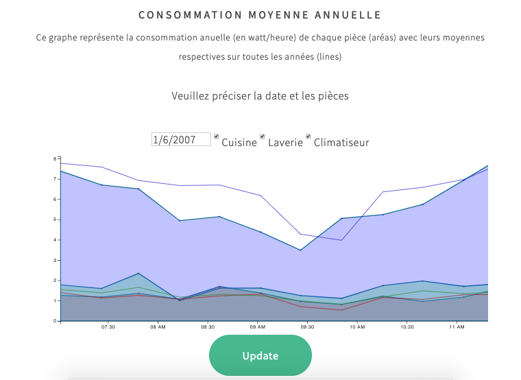

# Welcome to the dataviz-electricite-conso project!

### This projects aims to visualise data related to the consumption of household energy 

## Links to requirements and courses
- [Course] (https://lyondataviz.github.io/teaching/lyon1-m2/2019/)
- [University Claude Bernard Lyon 1] (https://www.univ-lyon1.fr/)
- [Project requirement] (https://lyondataviz.github.io/teaching/lyon1-m2/2019/projets.html

- [Master Information Technology (Data Science)] (http://master-info.univ-lyon1.fr/DS/)
- [Master Information Technology (Artificial Intelligence)] (http://master-info.univ-lyon1.fr/IA/)

## Group members : 
- Lien Que BUI
- Oreste GAFILIGI
- Minh Luan HOA
- Nour MEDJEDEL

## Links of data used in this project : 
- [link](https://archive.ics.uci.edu/ml/datasets/individual+household+electric+power+consumption) with missing values (data pre-processing needed)

## Dataset description
1.date: Date in format dd/mm/yyyy

2.time: time in format hh:mm:ss

3.global_active_power: household global minute-averaged active power (in kilowatt). Global active power is the power consumed by appliances other than the appliances mapped to Sub Meters. Global active power is the real power consumption i.e. the power consumed by electrical appliances other than the sub metered appliances.It is basically called wattfull power.

4.global_reactive_power: household global minute-averaged reactive power (in kilowatt). Global reactive power is the power which bounces back and froth without any usage or leakage. It is the imaginary power consumption. It is basically called wattless power.

5.voltage: minute-averaged voltage (in volt)

6.global_intensity: household global minute-averaged current intensity (in ampere). Intensity is magnitude of the power consumed. Also called as strength of current.

7.sub_metering_1: energy sub-metering No. 1 (in watt-hour of active energy). It corresponds to the kitchen, containing mainly a dishwasher, an oven and a microwave (hot plates are not electric but gas powered).

8.sub_metering_2: energy sub-metering No. 2 (in watt-hour of active energy). It corresponds to the laundry room, containing a washing-machine, a tumble-drier, a refrigerator and a light.

9.sub_metering_3: energy sub-metering No. 3 (in watt-hour of active energy). It corresponds to an electric water-heater and an air-conditioner.

## Preprocessed data
[link drive - in compressed file data.rar](https://drive.google.com/drive/folders/1DabjyJMGjsyqjZDjEPxz8-r9sdVCDExh)

## Project Organization (20/12/19)

### Data pre-processing (Lien) 
- Removing unnecessary columns
- Adding 4th category column
- Replacing the missing values by the column's average value
- Calculation of average values by days, months, years for each category

### Visualization:  
- Dynamic line graph by time (5 Lines) (Oreste)
  + Visualisation by day : frequency by minute (24*60 data points)  (filter by date+month+year)
  + Visualisation by month  : frequency by hour (24 * 12 data points) (filter by year)  
  + Visualisation by year : frequency par 6 months ((2010-2006)x2 data points) 
- Line chart (Luan): report by years (differences between 4 categories) (ref: https://dvprojectelisalorrainelucia.github.io/#chart_geo)  
- Assembling graphes + design (Nour)

## Possible Comparison :  
A year by mean of years
